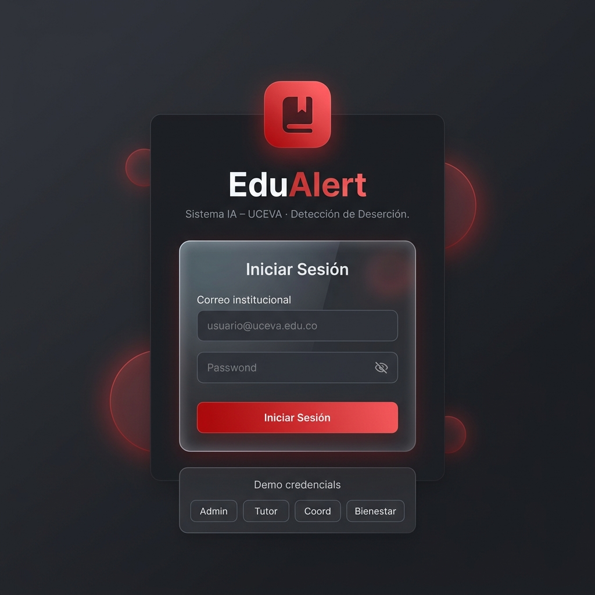
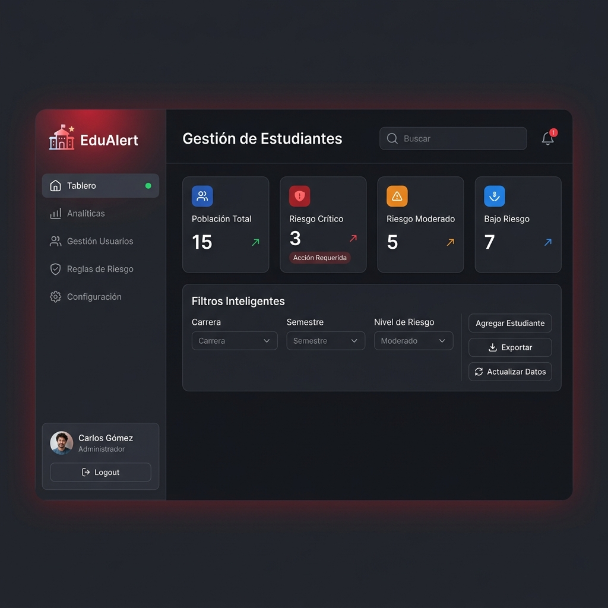
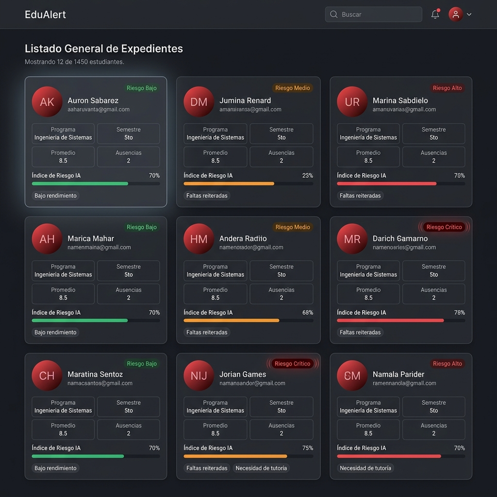
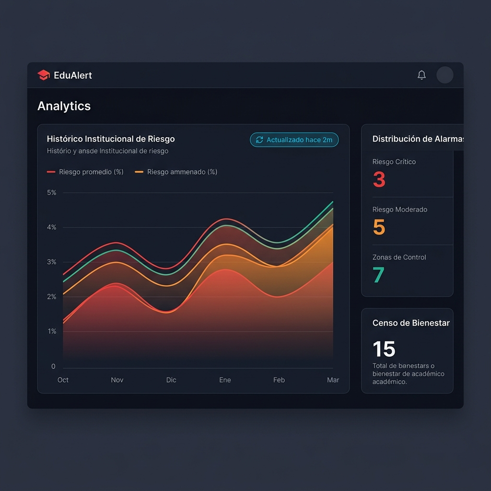
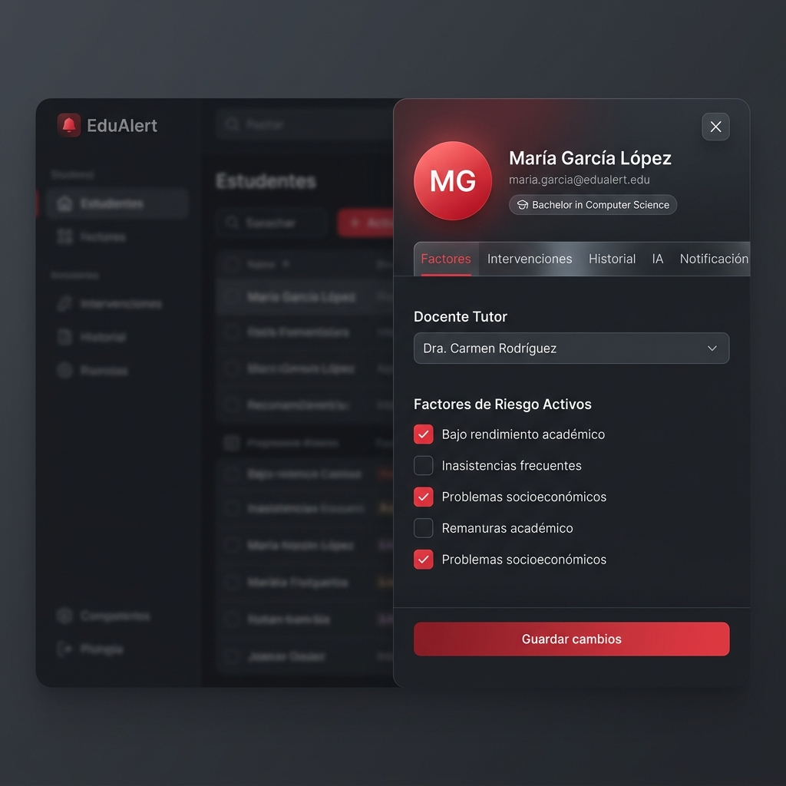
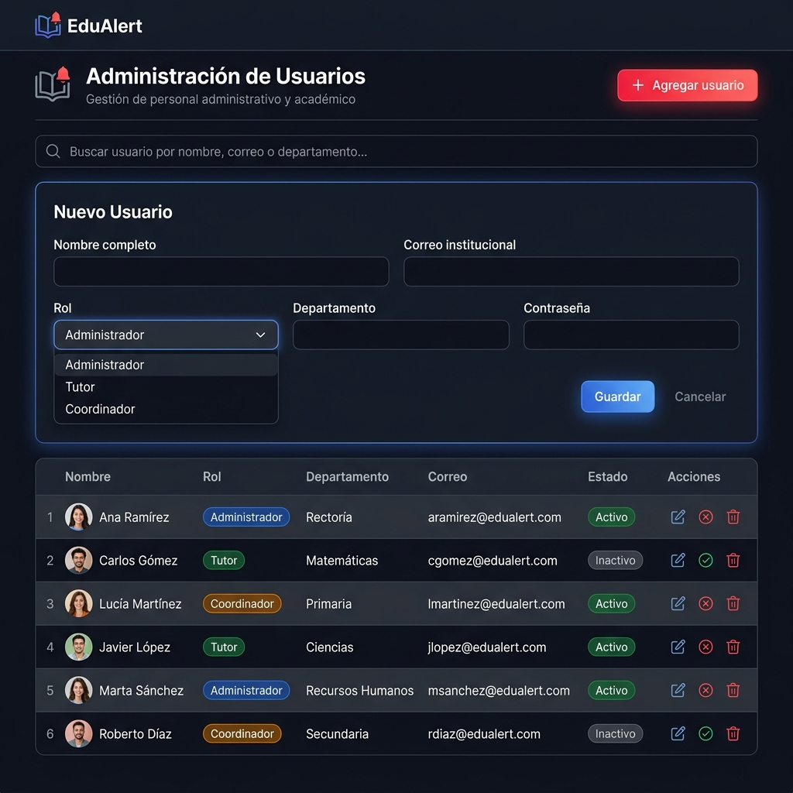

# Manual de Usuario - Sistema EduAlert

Bienvenido al manual de usuario del sistema **EduAlert**. Este documento está diseñado para guiar a los administradores, coordinadores y docentes (tutores) en el uso de la plataforma institucional para la detección temprana y seguimiento del riesgo de deserción estudiantil.

---

## Índice
1. [Acceso al Sistema](#1-acceso-al-sistema)
2. [Panel de Control Principal (Dashboard)](#2-panel-de-control-principal-dashboard)
3. [Módulo de Análisis y Reportes](#3-módulo-de-análisis-y-reportes)
4. [Gestión de Estudiantes: Creación y Seguimiento](#4-gestión-de-estudiantes-creación-y-seguimiento)
5. [Gestión de Usuarios y Roles](#5-gestión-de-usuarios-y-roles)

---

## 1. Acceso al Sistema

Para ingresar a la plataforma, diríjase a la URL oficial del sistema. Se le presentará la pantalla de inicio de sesión donde deberá usar sus credenciales institucionales.

1. Ingrese su **Correo Institucional** (ej. usuario@uceva.edu.co).
2. Digite su **Contraseña** segura.
3. Haga clic en el botón **"Iniciar Sesión"**.

> **Nota:** Si usted no cuenta con un usuario, puede hacer clic en "Solicitar acceso" en la parte inferior de la pantalla para ser redirigido al formulario de registro, el cual deberá ser aprobado por un administrador.

---

## 2. Panel de Control Principal (Dashboard)

Una vez haya ingresado, se encontrará con el panel principal de gestión. Este espacio centraliza la información más crítica de la población estudiantil bajo su supervisión.

### Elementos del Dashboard:
- **Barra de Navegación Lateral (Menú):** Permite cambiar entre el Tablero, Analíticas, Gestión de Usuarios y Configuraciones (las opciones varían según el rol).
- **Notificaciones (Campana Superior):** Le alerta sobre cambios críticos en los niveles de riesgo de sus estudiantes.
- **Tarjetas de Estadísticas Globales:** Un resumen inmediato de la "Población Total" y cuántos estudiantes se encuentran en "Riesgo Crítico", "Moderado" y "Bajo Riesgo".
- **Filtros Inteligentes:** Utilícelos para segmentar a los estudiantes por "Carrera", "Semestre" o "Nivel de Riesgo". 

### Listado General de Expedientes (Tarjetas de Estudiantes)

Debajo de los filtros encontrará el listado de estudiantes en formato de tarjetas individuales. 

Cada tarjeta proporciona una vista rápida de:
- Programa y Semestre del estudiante.
- Promedio académico y número de ausencias.
- **Nivel de Riesgo actual:** Codificado por colores (Bajo en verde, Medio en naranja, Alto/Crítico en rojo).
- **Índice de Riesgo IA:** Una barra de porcentaje generada por la Inteligencia Artificial del sistema.
- **Alertas Tempranas:** Etiquetas con observaciones rápidas.

---

## 3. Módulo de Análisis y Reportes

Este módulo (disponible para Administradores y Coordinadores) consolida los datos de toda la institución en gráficos claros para la toma de decisiones.

- **Histórico Institucional de Riesgo:** Gráfico que muestra la evolución promedio del índice de riesgo de los estudiantes a través de los últimos 6 meses.
- **Distribución de Alarmas:** Un conteo rápido y visual de la cantidad exacta de alumnos en los diferentes rangos de riesgo en tiempo real.
- **Censo de Bienestar:** Refleja la totalidad de la población monitoreada de forma activa por EduAlert.

---

## 4. Gestión de Estudiantes: Creación y Seguimiento

El flujo principal de los **Docentes / Tutores** consiste en registrar estudiantes y hacerles seguimiento detallado mediante intervenciones y análisis de factores de riesgo.

### Paso 1: Agregar un Estudiante
Si tiene los permisos, en el panel principal seleccione **"Agregar Estudiante"**. Se abrirá un formulario solicitando:

*(El modal de creación presenta campos claros y obligatorios para enrolar un alumno)*

1. Ingrese el Nombre Completo, Código Estudiantil y Correo Institucional.
2. Seleccione la Facultad, Programa Académico y Semestre.
3. Opcionalmente, añada un Promedio Inicial y número de Inasistencias.
4. Haga clic en **"Registrar Estudiante"**.

### Paso 2: Seguimiento e Intervención (Vista Detallada)
Para gestionar el caso de un estudiante, haga clic sobre su tarjeta en el panel principal. Esto abrirá el **Panel Lateral de Detalles del Estudiante**.

En este panel encontrará distintas pestañas funcionales:
- **Factores:** Seleccione los factores de riesgo activos del estudiante (ej. "Bajo rendimiento académico", "Problemas socioeconómicos") para actualizar el algoritmo de cálculo. 
- **Intervenciones:** Registre cada reunión o llamada realizada con el estudiante. Este será su diario de seguimiento oficial.
- **Historial:** Un registro cronológico inmutable de cómo ha fluctuado su nivel de riesgo a través del tiempo.
- **Recomendaciones IA (Pestaña "IA"):** Si no sabe cómo proceder, consulte al motor neuronal del sistema para que le brinde recomendaciones de acción específicas según los factores marcados para ese alumno.
- **Notificación:** Visualice y envíe un correo electrónico estandarizado al estudiante u otros dependientes.

---

## 5. Gestión de Usuarios y Roles

La configuración del equipo de trabajo se realiza en la vista de **Gestión de Usuarios** (solo para administradores).

- **Agregar Personal:** Utilice el botón superior para dar de alta a nuevos Docentes, Coordinadores o personal de Bienestar.
- **Roles:** Defina correctamente el rol de la persona. Esto limitará o habilitará su acceso a módulos sensibles como la sección de Estadísticas.
- **Modificación y Estado:** La tabla principal le permite visualizar quién está activo. En la columna de "Acciones" podrá editar sus datos, desactivar temporalmente o eliminar la cuenta.

---
**Nota final:** EduAlert ha sido diseñado bajo estándares modernos de accesibilidad y facilidad de uso. Todo cambio realizado es registrado por el sistema en tiempo real. ¡Gracias por contribuir a la permanencia estudiantil en la UCEVA!
