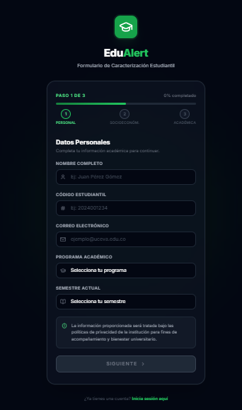
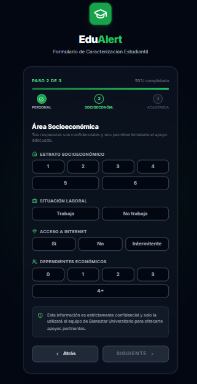
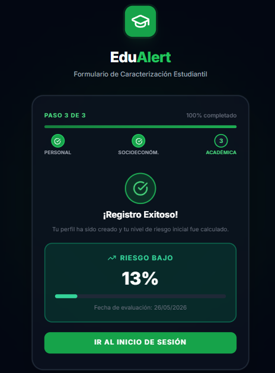

# Manual de Usuario - Portal de Estudiantes

Bienvenido al manual de uso del portal de estudiantes de **EduAlert**. Esta guía te explicará paso a paso cómo realizar tu proceso de auto-registro, completar la caracterización socioeconómica y consultar tu estado actual en la plataforma.

---

## Índice
1. [¿Qué es EduAlert?](#1-qué-es-edualert)
2. [Paso 1: Datos Personales](#2-paso-1-datos-personales)
3. [Paso 2: Encuesta Socioeconómica](#3-paso-2-encuesta-socioeconómica)
4. [Paso 3: Área Académica y Resultado](#4-paso-3-área-académica-y-resultado)

---

## 1. ¿Qué es EduAlert?

EduAlert es el sistema inteligente de bienestar de la institución diseñado para acompañarte en tu trayectoria académica. A través de este portal, podrás registrar tus datos para que el equipo de tutores y bienestar te brinden el apoyo necesario en caso de que presentes dificultades.

Para iniciar, debes ingresar a la dirección del portal de estudiantes y seguir el proceso de caracterización (Auto-registro).

---

## 2. Paso 1: Datos Personales

Al ingresar a la pantalla de registro, encontrarás el **Paso 1 de 3: Datos Personales**.

En esta sección deberás proporcionar tu información básica:
1. **Nombre Completo:** Ingresa tus nombres y apellidos completos.
2. **Código Estudiantil:** Digita tu código de identificación asignado por la institución.
3. **Correo Electrónico:** Es indispensable usar tu correo institucional (`@uceva.edu.co`).
4. **Programa Académico:** Selecciona la carrera que te encuentras cursando.
5. **Semestre Actual:** Indica el semestre en el que estás matriculado.

Una vez validados todos los datos, el botón **"Siguiente"** se iluminará y te permitirá avanzar.

---

## 3. Paso 2: Encuesta Socioeconómica

El bienestar integral no solo se trata de notas. En el **Paso 2**, deberás completar una breve encuesta sobre tus condiciones socioeconómicas.

Las preguntas incluyen:
- **Estrato Socioeconómico:** Selecciona un número del 1 al 6.
- **Situación Laboral:** Indica si actualmente te encuentras laborando además de estudiar.
- **Acceso a Internet:** Responde con sinceridad si tienes acceso constante, intermitente o nulo.
- **Dependientes Económicos:** Si tienes personas a tu cargo, indícalo aquí.

> **Importante:** La información proporcionada es estrictamente confidencial. Solo será visualizada por el personal autorizado de Bienestar Universitario con el único fin de ofrecerte apoyos o subsidios pertinentes.

Si te equivocaste, puedes usar el botón **"Atrás"**. De lo contrario, haz clic en **"Siguiente"**.

---

## 4. Paso 3: Área Académica y Resultado

En el último paso, se te solicitará información sobre tu estado académico actual, como el promedio que llevas, inasistencias y materias cursando.

Una vez finalices y envíes la encuesta, el algoritmo de inteligencia artificial de EduAlert calculará de forma automática e inmediata tu **Índice de Riesgo**.

Se te presentará la pantalla de **¡Registro Exitoso!** en donde podrás visualizar:
- Un **porcentaje** que representa tu índice calculado por la IA.
- El **nivel en el que te encuentras** (ej. "Riesgo Bajo", "Riesgo Medio", etc.).
- La **fecha exacta** de esta evaluación.

A partir de este momento, ya formas parte de la red de protección de EduAlert. Tu tutor asignado o un profesional de bienestar podrá contactarte a través del correo institucional proporcionado si identifica que necesitas acompañamiento. 

Puedes hacer clic en **"Ir al Inicio de Sesión"** si deseas explorar tu perfil de estudiante o responder nuevas alertas enviadas por la institución.
